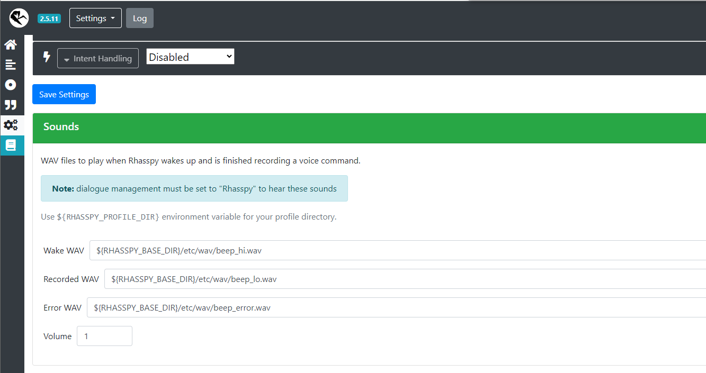
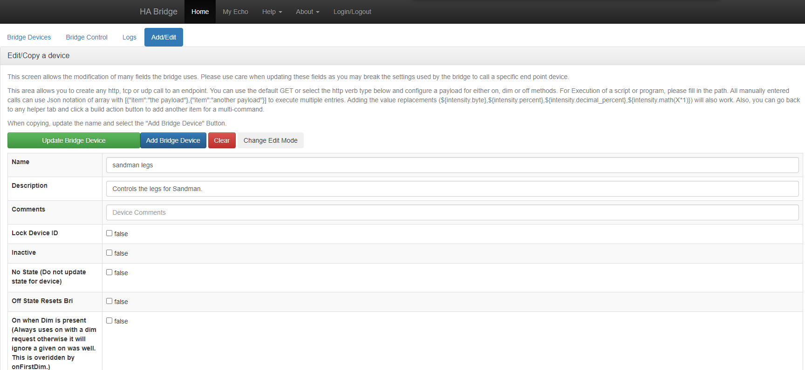
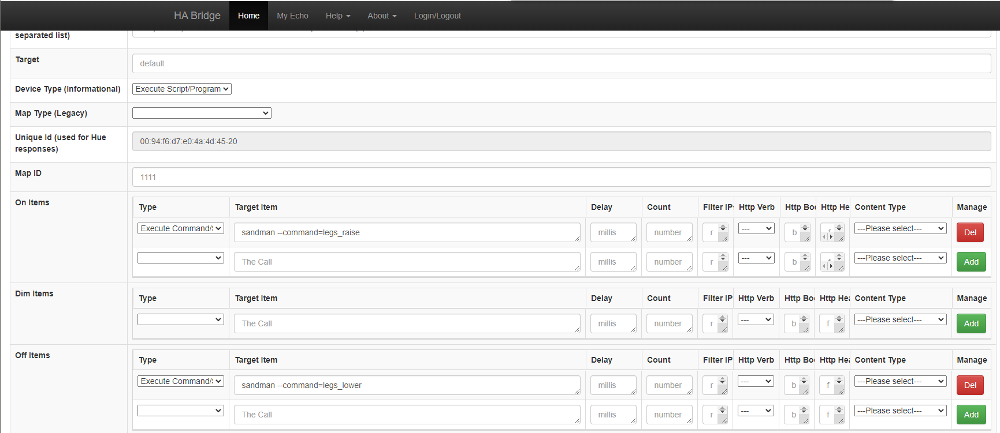

# Sandman

Sandman is a device that is intended to assist people, particularly those with disabilities, in using hospital style beds. Therefore, it is not just software, but a combination of both software and hardware. The software is primarily designed to enable controlling a bed by voice. However, work is also underway on providing analytics of usage through a web interface. Currently the software is intended to be run on a Raspberry Pi, and is primarily developed on a Raspberry Pi 4.

## Installation

### Rhasspy

Sandman relies on [Rhasspy](https://rhasspy.readthedocs.io) to provide voice control and auditory feedback. Follow these [instructions](https://rhasspy.readthedocs.io/en/latest/installation/). However, use the following command to start the Docker image rather than the one in the instructions, because we need to expose an additional port.

```bash
docker run -d -p 12101:12101 -p 12183:12183 \
      --name rhasspy \
      --restart unless-stopped \
      -v "$HOME/.config/rhasspy/profiles:/profiles" \
      -v "/etc/localtime:/etc/localtime:ro" \
      --device /dev/snd:/dev/snd \
      rhasspy/rhasspy \
      --user-profiles /profiles \
      --profile en
```

Once Rhasspy is running, it can be configured through its web interface by going to YOUR_SANDMAN_IP_ADDRESS:12101. 

#### Settings

If you click on the icon which looks like a set of gears, you should see an interface that looks something like the following, although the settings may be different:


It is recommended that you set all of the settings to the same thing as pictured above, but you may use whichever text to speech option you like. You will also have to fill out the device information underneath the Audio Recording and Audio Playing settings. You can also choose whichever wake word you prefer under Wake Word. When you're done, click on the Save Settings button. Please note that you may have to do this iteratively, and you may be asked to download data for some of the settings. You can test the audio recording and playback by clicking on the icon that looks like a house.

#### Sentences

Sentences are the grammar which dictates the conversations you can have. If you click the sideways looking bar graph icon, you will see the following interface, although the highlighted text may be different.


No need to type all of this out! You can copy the sentences from [here](rhasspy/sandman_rhasspy_sentences.txt). Then you will need to click the button that says Save Sentences. This should cause the grammar to be generated.

#### Wake Sounds

If you would like to change the wake sounds, you can use the provided sounds or use your own by first copying them into the configuration location like this:

```bash
sudo mkdir ~/.config/rhasspy/profiles/en/wav
sudo cp ~/sandman/rhasspy/wav/* ~/.config/rhasspy/profiles/en/wav/
```

You can find the sound setting by clicking on the icon that looks like a set of gears and scrolling down. It looks like the following image:



Then you can replace each path with the following:

```bash
${RHASSPY_PROFILE_DIR}/wav/beep-up.wav
${RHASSPY_PROFILE_DIR}/wav/beep-down.wav
${RHASSPY_PROFILE_DIR}/wav/beep-error.wav
```

Click Save Settings and it should start using the new sounds.

### Sandman

Currently, building Sandman from source requires the following libraries:

```bash
sudo apt-get install bison autoconf automake libtool libncurses-dev libxml2-dev libmosquitto-dev libsdl1.2-dev libsdl-mixer1.2-dev
```

Then, it can be built and installed with the following commands:

```bash
autoreconf --install
./configure
make
sudo make install
```

### ha-bridge

Although the speech recognition provided by Rhasspy is a decent offline option, you may want to use Sandman with Alexa enabled devices. Although there is no direct integration at the moment, you can use [ha-bridge](https://github.com/bwssytems/ha-bridge) as a way of controlling a bed as though it is a series of light switches.

Once you have set up ha-bridge, you can add devices through its web interface by going to YOUR_SANDMAN_IP_ADDRESS. If you go to Bridge Devices, you should see an interface something like the following:


When you edit/copy a device, the first important thing is the name. This is the name that you will have to use to refer to the device with Alexa.



The next picture demonstrates how to set up the device so that telling it to turn on will move a part of the bed in one direction, and telling it to turn off will move it in the other direction.



You can test the devices from the device page, and once you have set them all up you can go through the discovery process.

## Usage

Once you have built and installed Sandman, you can execute it from the command line like this, which will start it in interactive mode:

```bash
sudo /usr/local/bin/sandman
```

To exit this mode, simply type quit followed by pressing the enter key. This is primarily used for testing/debugging.

To run it as a daemon instead, use the following command:

```bash
sudo /usr/local/bin/sandman --daemon
```

The following commands are examples of how you can send commands to Sandman running as a daemon:

```bash
sudo /usr/local/bin/sandman --command=back_raise
sudo /usr/local/bin/sandman --command=back_lower
sudo /usr/local/bin/sandman --command=legs_raise
sudo /usr/local/bin/sandman --command=legs_lower
sudo /usr/local/bin/sandman --command=elevation_raise
sudo /usr/local/bin/sandman --command=elevation_lower
```

You can stop Sandman running as a daemon with:

```bash
sudo /usr/local/bin/sandman --shutdown
```

### Running on boot

If you would like to run Sandman at boot, an init script is provided. You can start using it with the following commands:

```bash
sudo cp sandman.sh /etc/init.d/
sudo chmod +x /etc/init.d/sandman.sh
sudo update-rc.d sandman.sh defaults
```

## Roadmap

### Software

* Implement a web interface for viewing recorded reports using Flask.
* Convert the schedule to JSON.
* Implement a web interface for modifying the schedule.
* Simplify setup?
* Switch to systemd?

## Contributing

Sandman was been in development privately for many years before going public. As things are getting off the ground, please open an issue to see how you can get involved. Advice on running an open source project is also welcome.

## License

[MIT](https://choosealicense.com/licenses/mit/)